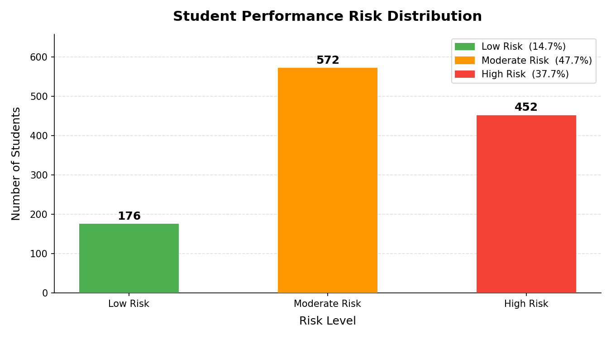
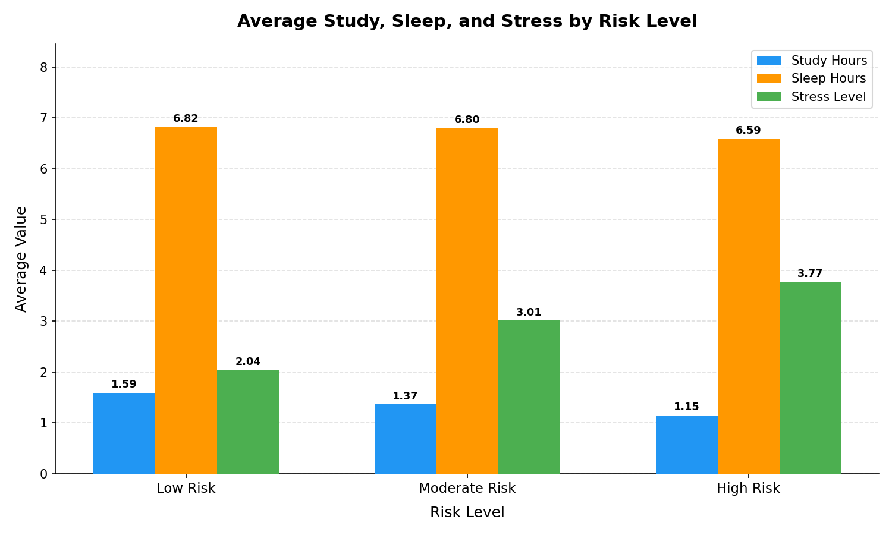
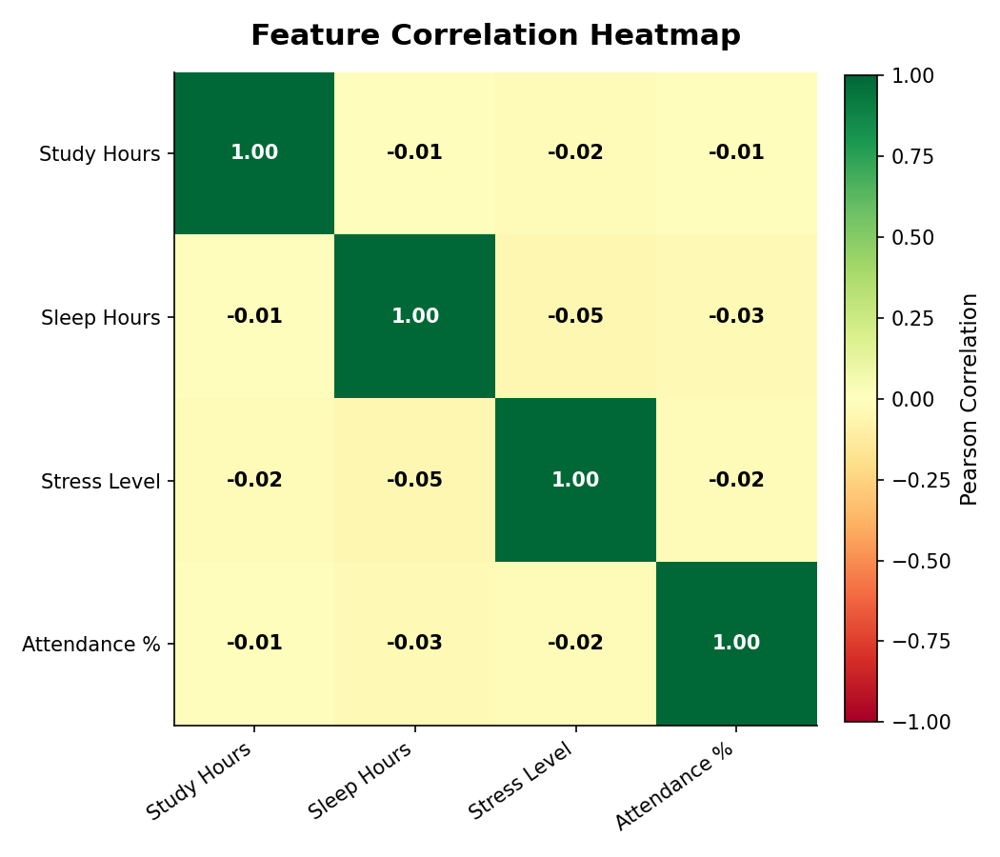
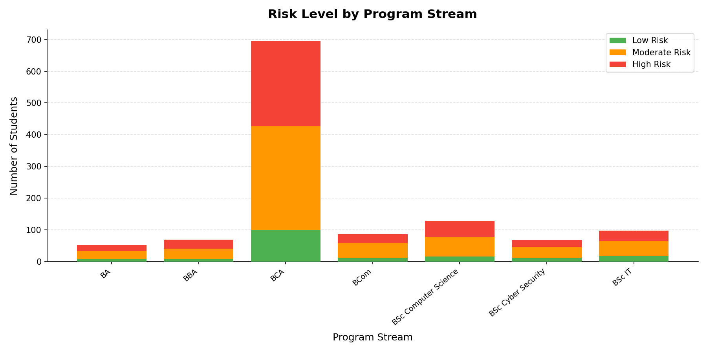

# Student Performance Analysis Report

> **Generated:** 2026-06-13 20:07  
> **Dataset:** hybrid_student_performance.csv  
> **Total Records Analysed:** 1,200

---

## 1. Dataset Overview

| Metric | Value |
| --- | --- |
| Total Students | 1,200 |
| Program Streams | 7 |
| Risk Categories | 3 |
| Avg Study Hours / Day | 1.32 |
| Avg Sleep Hours / Night | 6.73 |
| Avg Stress Level (1-10) | 3.15 |
| Avg Attendance % | 66.72 |

## 2. Risk Distribution

| Risk Level | Students | Percentage |
| --- | --- | --- |
| Low Risk | 176 | 14.7% |
| Moderate Risk | 572 | 47.7% |
| High Risk | 452 | 37.7% |

## 3. Study, Sleep & Stress by Risk Level

| Risk Level | Avg Study Hrs | Avg Sleep Hrs | Avg Stress |
| --- | --- | --- | --- |
| Low Risk | 1.59 | 6.82 | 2.04 |
| Moderate Risk | 1.37 | 6.8 | 3.01 |
| High Risk | 1.15 | 6.59 | 3.77 |

## 4. Attendance by Risk Level

| Risk Level | Avg Attendance % |
| --- | --- |
| Low Risk | 74.7 |
| Moderate Risk | 69.6 |
| High Risk | 62.0 |

## 5. Feature Correlations

|  | Study Hrs | Sleep Hrs | Stress | Attendance % |
| --- | --- | --- | --- | --- |
| Study Hrs | 1.00 | -0.01 | -0.02 | -0.01 |
| Sleep Hrs | -0.01 | 1.00 | -0.05 | -0.03 |
| Stress | -0.02 | -0.05 | 1.00 | -0.02 |
| Attendance % | -0.01 | -0.03 | -0.02 | 1.00 |

## 6. Risk by Program Stream

| Program Stream | Low Risk | Moderate Risk | High Risk |
| --- | --- | --- | --- |
| BA | 9 | 25 | 19 |
| BBA | 9 | 32 | 28 |
| BCA | 99 | 328 | 269 |
| BCom | 13 | 45 | 29 |
| BSc Computer Science | 16 | 62 | 51 |
| BSc Cyber Security | 13 | 33 | 22 |
| BSc IT | 17 | 47 | 34 |

## 7. Key Findings

- **37.7%** of students are High Risk (452 students) — a significant cohort requiring targeted support.
- Low Risk students study **0.44 hrs/day more** than High Risk peers.
- Stress is **1.73 points higher** on average for High Risk students.
- Strongest correlation: **Sleep Hrs** ↔ **Stress** (r = -0.05).
- Higher attendance consistently aligns with lower risk levels across all programs.

## 8. Recommendations

1. **Early Intervention** — Flag students with < 2 study hrs/day and stress > 7.
2. **Attendance Alerts** — Trigger counsellor review when attendance falls below 66%.
3. **Wellness Workshops** — Target sleep hygiene sessions at Moderate & High Risk cohorts.
4. **Program-Level Resourcing** — Allocate tutoring to streams with highest High Risk ratios.
5. **Predictive Modelling** — Dataset is ready for classification (Random Forest, XGBoost).

---

*Report generated automatically by Student Performance Analyzer.*